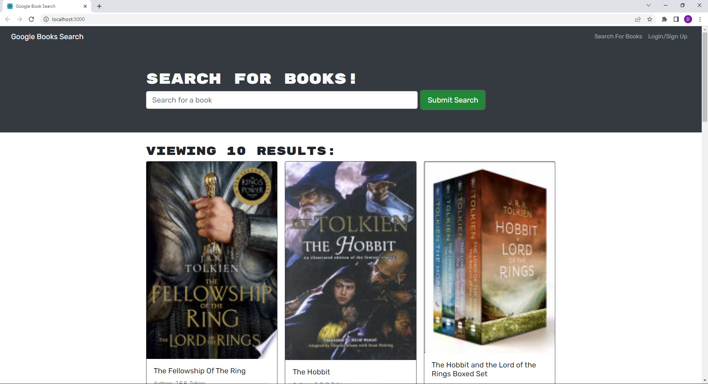

# BOOK SEARCH ENGINE

This is a full MERN stack application that uses graphql to allow a user  
to search for, and save favorite books from the google books API.

[Link to deployed heroku app](https://powerful-stream-89344.herokuapp.com/)

## Description

This application uses React.js along with MongoDB on the back end and graphQL. It allows  
a user to signup/sign in, search for any book using a third party book api, and add or remove  
those books to a personal list of favorites. It implements JWT as the authentication, and local  
storage to reduce db loads. The entire app runs off of Apollo server/client.

### Installing

No installation necessary.

### Executing program

For users, click 'signup' on the homepage to make a new user. Once logged in, simply  
search for any book in the search bar. You can click the button to save the book. To view all  
of your saved books, click the button to navigate at the top of the page.

### Testing

No testing currently available.

## Authors

Dylan Crowley:

[Github](https://github.com/dcrowdev)  